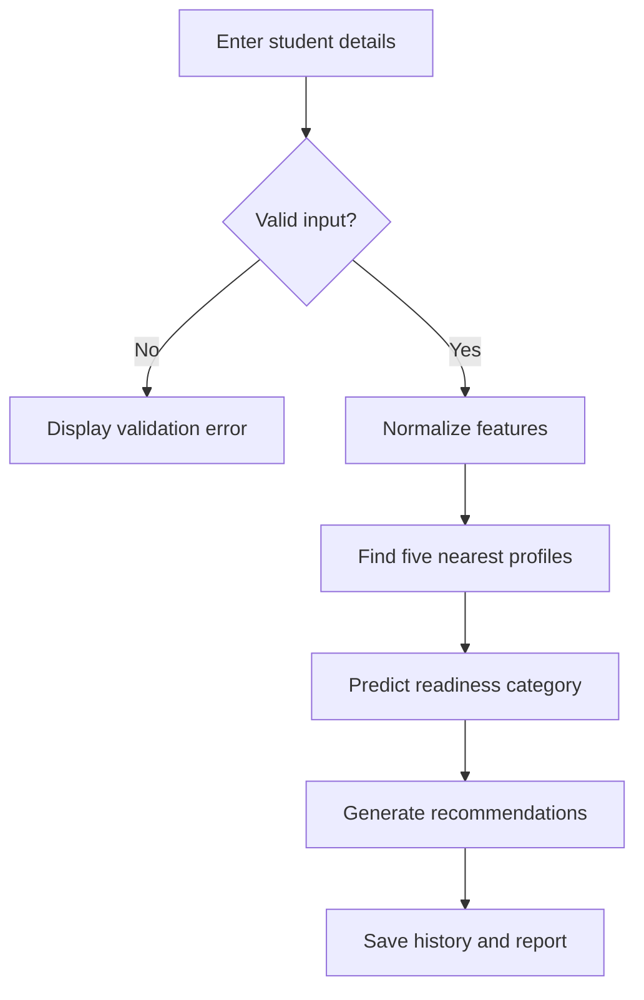
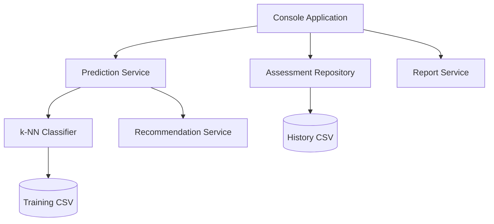

# AI-Based Placement Readiness Analyzer

A Java 17 console application that uses a normalized k-nearest-neighbours (k-NN) classifier to estimate a student's placement readiness and generate personalised recommendations.

## Features

- Validates academic, coding, aptitude, project and interview inputs
- Predicts `NOT_READY`, `MODERATELY_READY` or `PLACEMENT_READY`
- Uses min-max normalization so features with large values do not dominate distance
- Resolves tied votes using the total distance of neighbours
- Saves assessment history as CSV
- Generates a readable student report
- Includes executable validation tests

## Modules

1. Input and validation
2. ML prediction
3. Recommendation generation
4. Storage and report generation

## Repository Structure

```text
java-ai-placement-project/
├── data/
│   └── training_data.csv
├── src/
│   ├── main/java/com/vityarthi/placement/
│   │   ├── app/
│   │   │   └── ConsoleApplication.java
│   │   ├── exception/
│   │   │   └── ValidationException.java
│   │   ├── ml/
│   │   │   ├── CsvDataLoader.java
│   │   │   └── KnnClassifier.java
│   │   ├── model/
│   │   │   ├── PredictionResult.java
│   │   │   ├── ReadinessLevel.java
│   │   │   ├── StudentProfile.java
│   │   │   └── TrainingExample.java
│   │   ├── repository/
│   │   │   └── AssessmentRepository.java
│   │   ├── service/
│   │   │   ├── PredictionService.java
│   │   │   ├── RecommendationService.java
│   │   │   └── ReportService.java
│   │   └── validation/
│   │       └── InputValidator.java
│   └── test/java/com/vityarthi/placement/
│       └── ProjectTests.java
├── reports/
│   └── Generated student reports
├── .gitignore
├── pom.xml
├── README.md
└── statement.md
```

### Package Responsibilities

| Package | Responsibility |
| --- | --- |
| `app` | Starts the program and handles console interaction |
| `ml` | Loads training data and performs k-NN classification |
| `model` | Contains the application's data records and readiness levels |
| `service` | Coordinates prediction, recommendations and report generation |
| `repository` | Saves assessment history to CSV |
| `validation` | Validates student input values |
| `exception` | Provides application-specific validation errors |

## Requirements

- JDK 17 or newer
- Maven 3.9+ (recommended)

## Run in IntelliJ IDEA

1. Open the `placement-readiness-analyzer` folder.
2. Allow IntelliJ to import the Maven project.
3. Open `ConsoleApplication.java`.
4. Click the green Run button beside `main`.

The working directory must be the project root so the application can find `data/training_data.csv`.

## Run in a terminal

```bash
mvn clean compile
mvn exec:java
```

## Run the tests

```bash
mvn test-compile
java -cp target/classes:target/test-classes com.vityarthi.placement.ProjectTests
```

On Windows, replace `:` in the classpath with `;`.

## Workflow



## Architecture



## Important dataset note

The included dataset is small demonstration data used only to make the code runnable. For a final academic submission, replace it with an anonymised dataset containing genuine outcomes and document the collection method. Do not calculate labels directly from the same features and present the resulting accuracy as real-world model performance.

## Suggested evaluation

- Use a stratified train/test split on a larger genuine dataset.
- Report accuracy, precision, recall, F1-score and a confusion matrix.
- Compare multiple odd values of k.
- Explain why normalization is required for distance-based algorithms.

## Future enhancements

- JavaFX graphical interface
- SQLite database with JDBC
- Cross-validation and confusion-matrix screen
- Login roles for students and faculty
- PDF report generation
- Progress charts across repeated assessments
